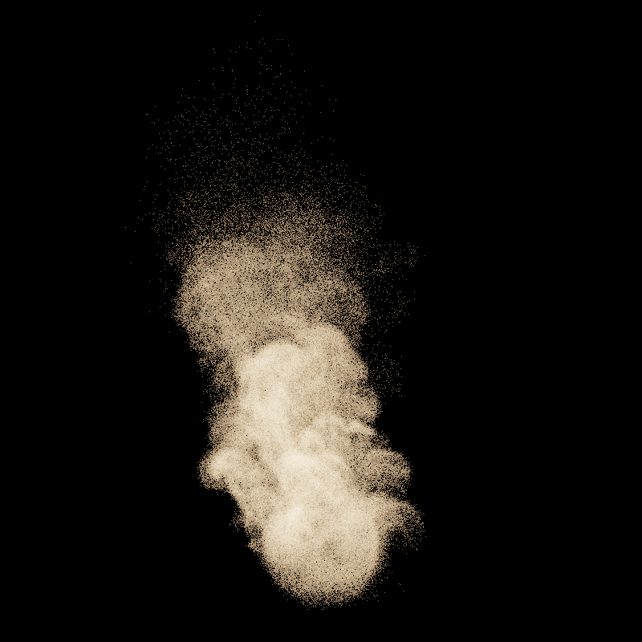
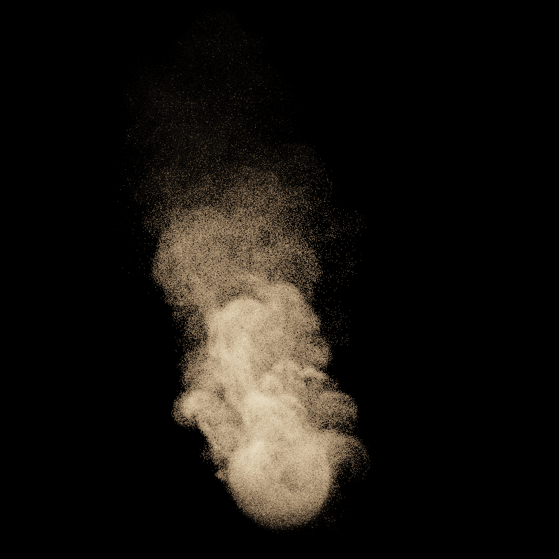
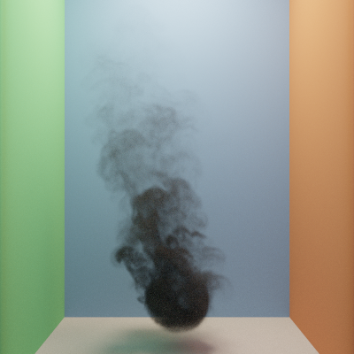
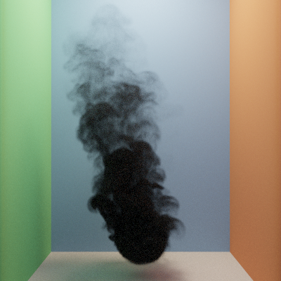
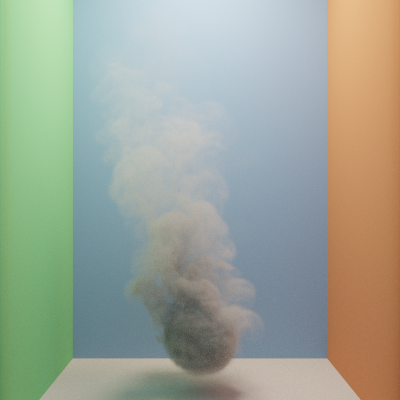
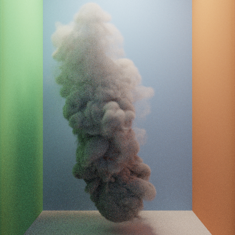

GPU-Accelerated Heterogeneous Volume Rendering with Null-Collisions
================

**University of Pennsylvania, CIS 565: GPU Programming and Architecture, Final Project**

* Nick Moon
  * [LinkedIn](https://www.linkedin.com/in/nick-moon1/), [personal website](https://nicholasmoon.github.io/)
* Megan Reddy
  * [LinkedIn](https://www.linkedin.com/in/meganr25a949125/), [personal website](https://meganr28.github.io/)
* Tested on: Windows 10, AMD Ryzen 9 5900HS with Radeon Graphics @ 3301 MHz 16GB, NVIDIA GeForce RTX 3060 Laptop GPU 6GB (Personal Computer)

### Overview

<p align="center">
  
<p align="center"><em>Intel Cloud rendered with the null-scattering MIS framework</em></p>

[Insert more pictures/gif/video here]

**Physically-based volume rendering** is widely used in the entertainment and scientific engineering fields for rendering phenomena such as clouds, fog, smoke, and fire. This usually involves complex lighting computations, especially for volumes that vary spatially and spectrally. Production renderers leverage multiple importance sampling (MIS) to accelerate image synthesis for rendering surfaces. MIS techniques for volumes are unbiased only for homogeneous media. Therefore, we require a new technique to perform MIS for heterogeneous media. 

The [null-scattering path integral formulation](https://cs.dartmouth.edu/wjarosz/publications/miller19null.html) (Miller et al. 2019) enables us to use MIS for any media and generalizes previous techniques such as ratio tracking, delta tracking, and spectral tracking. It analytically solves for the pdf of a light path during runtime, allowing us to combine several sampling techniques at once using MIS. Additionally, null-scattering introduces fictitious matter into the volume, which does not affect light transport, but instead allows us to "homogenize" the total density and analytically sample collisions. We implement the null-scattering formulation in **CUDA** and use **NanoVDB** for loading volumetric data. 

### Presentations

[Final Project Pitch](https://docs.google.com/presentation/d/1bVFEcVQq_lp9oRMo1wMy-prI_6DmvS1U/edit?usp=sharing&ouid=114838708762215680291&rtpof=true&sd=true)

[Milestone 1 Presentation](https://docs.google.com/presentation/d/14UCT0gwEhKlZwesXNz6KYzMYFSW_foeX/edit?usp=sharing&ouid=114838708762215680291&rtpof=true&sd=true)

[Milestone 2 Presentation](https://docs.google.com/presentation/d/1hIc8dso9Vw6BNq6eRFusN4aV4GLUBG46/edit?usp=sharing&ouid=114838708762215680291&rtpof=true&sd=true)

[Milestone 3 Presentation](https://docs.google.com/presentation/d/15A4sxapjhbVR1eCHo42OMfnLYpHewG0q/edit?usp=sharing&ouid=114838708762215680291&rtpof=true&sd=true)

### Features Implemented

- Completed
    * Heterogeneous media
      * Null-scattering MIS (next-event estimation and phase sampling)
      * Delta tracking
    * Homogeneous media
    * Interactions between surface and media
    * Volumes on the inside and outside of objects (medium interfaces)
    * Loading .vdb files
- In-Progress 
    * Debug and remove bias in null-scattering MIS renders (white pixels show up in renders)
    * Spectral MIS (with [hero wavelength sampling](https://cgg.mff.cuni.cz/publications/hero-wavelength-spectral-sampling/))
      
### Usage

#### Rendering Controls

- `Integrator`
- `Importance Sampling`
- `Max Ray Depth` - number of times light will bounce in each ray path
- `Extra Depth Padding`
- `Refresh Rate`

#### Camera Controls

- `FOV`
- `Focal Distance`
- `Lens Radius`

#### Volumetric Controls

- `Absorption` - amount of light absorbed while interacting with the medium (higher = darker)
- `Scattering` - amount of light scattering inside of the medium (out-scattering and in-scattering)
- `Asymmetry` - influences the direction of light scattering within the medium
- `Density Offset`
- `Density Scale`

### Build Instructions

To build this project, ensure that you have a **CUDA-enabled** NVIDIA GPU. We have provided some other basic requirements in the collapsable menu below:

<details>
  <summary>Build steps</summary>

1. Open the `.sln` file in Visual Studio and build in **Release** mode
2. In order to run a `.txt` file from the `scenes` folder, you must provide a command line argument. You can do this two ways:
    * Call the program with the argument: `null-collision-volumes-cuda scenes/cornell_boxes.txt` 
    * In Visual Studio, navigate to your project `Properties` and select `Configuration Properties -> Debugging -> Command Arguments` and provide the path to the scene file:
 `../scenes/cornell_boxes.txt`. Note that you may need to provide the full path instead of the relative path.
3. In `Properties -> C/C++ -> Optimization`, select `Maximum Optimization (Favor Speed) (/O2)`
4. In `Properties -> C/C++ -> Code Generation -> Runtime Library`, select `Multi-threaded (/MT)`
5. When building with `cmake`, if you run into an issue where it cannot find a library file, make sure the appropriate `.lib` file is in the `external` folder.

</details>
<br>

#### OpenVDB and NanoVDB

This project depends on OpenVDB and NanoVDB for loading volumetric data. We followed the build instructions for `Windows`, however, the [official OpenVDB development repository](https://github.com/AcademySoftwareFoundation/openvdb) has directions for other platforms.
The installation process for Windows was quite complicated and lengthy for us, so we've included the steps of our process incase it is of use to anyone else. Note that these might not necessarily be executed in order, and that building OpenVDB might differ depending on your system setup.

<details>
  <summary>Build steps</summary>

1. Install [vcpkg](https://github.com/microsoft/vcpkg), [CMake](https://cmake.org/), and [Visual Studio](https://visualstudio.microsoft.com/downloads/).
2. Run these commands in the directory with `vcpkg.exe` to install OpenVDB dependencies: 

```
vcpkg install zlib:x64-windows
vcpkg install blosc:x64-windows
vcpkg install tbb:x64-windows
vcpkg install boost-iostreams:x64-windows
vcpkg install boost-any:x64-windows
vcpkg install boost-algorithm:x64-windows
vcpkg install boost-uuid:x64-windows
vcpkg install boost-interprocess:x64-windows
vcpkg install openvdb:x64-windows
```

3. Clone and build the OpenVDB repository using the instructions [here](https://github.com/AcademySoftwareFoundation/openvdb) under `Windows -> Building OpenVDB`.
4. Place the resulting `openvdb` directory within your project.
5. Create a Visual Studio solution with CMake. We found the instructions [here](https://visualstudio.microsoft.com/downloads/) quite helpful (under `Build Steps`). 
5. In `FindOpenVDB.cmake`, remove lines 655-662 (this is old functionality). This file should be located under `vcpkg/installed/x64-windows/share/openvdb`.
6. In `CMakeLists.txt`, change `cmake_minimum_required(VERSION 3.1)` to `cmake_minimum_required(VERSION 3.18)`.
7. In `CMakeLists.txt`, add the following lines at the bottom of the file to include OpenVDB as a dependency. Replace the `vcpkg` path with the path to your installation.

```
list(APPEND CMAKE_MODULE_PATH "C:/src/vcpkg/vcpkg/installed/x64-windows/share/openvdb")
find_package(OpenVDB REQUIRED)
target_link_libraries(${CMAKE_PROJECT_NAME} OpenVDB::openvdb)
```

8. Include the appropriate header files in your project and see if you can build successfully. If not, check the OpenVDB site for [Troubleshooting tips](https://www.openvdb.org/documentation/doxygen/build.html#buildTroubleshooting). 
9. Note that NanoVDB files are included in the `openvdb` directory that you cloned.

</details>
<br>

### Main Concepts

#### Null-Scattering

Include diagram with null particles here. 

#### Null-Scattering MIS

Explain unidirectional and next-event estimation. Also explain why path integral formulation gives us an advantage over previous methods (we can calculate pdf).

### Pipeline 

| FullVolPathtrace Kernel Layout  | SampleChannel Kernel | 
|:----------:    |:-------------:  |
|  |  |

### Results

#### Loading Volumetric Data with NanoVDB

We use NanoVDB for loading and parsing volumetric data. NanoVDB is developed by NVIDIA and adds GPU acceleration support to OpenVDB. Since we did not use `.nvdb` files (the type supported by NanoVDB), we also
had to build OpenVDB to convert `.vdb` files to `.nvdb` for loading density grids. By itself, however, NanoVDB does not depend on OpenVDB. In the following images, we have rendered a few different `.vdb` files.

| Cloud Bunny (OpenVDB)  | Smoke (OpenVDB) | Torus (EmberGen)
|:----------:    |:-------------:  |:-------------:  |
|  |  | 

#### Unidirectional, Next-Event Estimation (NEE), and Uni + NEE MIS

To verify that our null-scattering framework was working as expected, we followed the same lighting setups described in the paper.
 
Case where unidirectional performs better

| Unidirectional  | Next-Event Estimation (NEE) | Unidirectional + NEE
|:----------:    |:-------------:  |:-------------:  |
|  |  | 

Case where NEE performs better

| Unidirectional  | Next-Event Estimation (NEE) | Unidirectional + NEE
|:----------:    |:-------------:  |:-------------:  |
|  |  | 

#### Varying Coefficients

There are three main volume scattering processes that impact light transport within a scene: absorption, scattering, and emission. We handle the first two in our implementation. Additionally, the amount of light being transmitted through the volume is dictated by the **Beer-Lambert** Law: `T = exp(-sigma_t * distance)`. As `sigma_t` (absorption + scattering) or `distance` increases, the medium becomes denser due to lower transmittance. 

##### Absorption

Absorption refers to the decrease in radiance as light travels through the medium. In the examples below, the smoke becomes thicker and darker as you increase the 
absorption coefficient (denoted by sigma_a in volume rendering literature and our code). A higher absorption coefficient means that as light travels through the medium,
the medium's particles absorb more of it. Therefore, less light reaches the viewer and the smoke plume appears darker. Increasing the absorption coefficient also increases the density of the medium as described by Beer's Law above. 

| sigma_a = 0.1  |  sigma_a = 0.2 | sigma_a = 0.4 | sigma_a = 0.8 |
|:----------:    |:-------------:  |:-------------:  |:-------------:  |
|   |    |  | 

##### Scattering

As a ray passes through a medium, it may scatter in different directions due to interactions with particles. Scattering involves both out-scattering, where the total
radiance is reduced because of the ray being deflected out of the path, and in-scattering, where the total radiance is increased due to light being scattered into the path. In the images below, we see that the smoke is lighter than in the images where absorption was the dominant effect. Although some light is attenuated as it travels farther through the medium, some light that is not traveling towards the viewer is redirected towards the eye. Similar to the absorption images, we notice that the smoke becomes denser as the scattering coefficient increases. 

| sigma_s = 0.1  | sigma_s = 0.2 | sigma_s = 0.4 | sigma_s = 0.8 |
|:----------:    |:-------------:  |:-------------:  |:-------------:  |
|   |    |  | 

##### Density

In homogeneous media, we have uniform density. In heterogeneous media, we have varying density over space. In the null-scattering framework, we set `sigma_t` equal 
to `sigma_a + sigma_s + sigma_n`. The new null coefficient `sigma_n` is not user-specified, but rather computed from the `sigma_a` and `sigma_s` values. We know that `sigma_t` is homogeneous, therefore we can set it to `max_density * (sigma_a + sigma_s)`, where `max_density` is the maximum density value in the voxel grid. Now, we can solve for `sigma_n`. This also ensures that none of the coefficients are negative. Increasing the multiplier for `max_density` increases the runtime, but does not change the result visually. This is because it increases the number of ray marching steps, causing us to take smaller steps through the medium. 

In the images below, we augment the density in a different manner. Instead of increasing the `max_density` value, we multiply each density value in the voxel grid by a constant amount. As we increase the multiplier, the medium appears more dense. 

| 1x  | 5x | 10x | 30x |
|:----------:    |:-------------:  |:-------------:  |:-------------:  |
|   |    |  | 

#### Henyey-Greenstein Phase Asymmetry Factor

The phase function of a volume is analogous to the BSDF of a surface since it describes the distribution of light being scattered. We implemented the commonly-used Henyey-Greenstein phase function, which is controlled by an asymmetry factor `g` that is within the range (-1, 1). Negative `g` values indicate back-scattering, where light is scattered back towards the incoming ray direction. Positive `g` values indicate forward-scattering, where light is scattered in the direction it was traveling. In the images below, notice how the back-scattering allows more light to reach the camera, whereas the forward-scattering is much darker. A `g` value of 0 indicates isotropic scattering, where it has the same value in different directions. Visually, it is almost an average of the back-scattering and forward-scattering images. 

| Back Scattering (g = -0.8) |   Near Isotropic Scattering (g = 0.001) |   Forward Scattering (g = 0.8) |
|:----------:    |:-------------:  |:-------------:  |
|   |    | 

### Performance

#### Testing Parameters

The following performance results were obtained 

The camera and lighting parameters are the same between the two scenes; the only difference is the setting in which we placed
smoke plume. Unless otherwise noted, we used these additional parameters:

- `Absorption`: 0.02
- `Scattering`: 0.2061
- `Phase Asymmetry`: 0.001
- `Iteration Count`: 20
- `Ray Depth`: 1
- `Resolution`: 800 x 800

For testing, we turned GUI rendering off (this took about 20 ms of render time). We wrapped the call to our `fullVolPathtrace` function
with a call to our `PerformanceTimer` class's functions `startGpuTimer` and `endGpuTimer`. We recorded the average rendering time over 
20 iterations. 

#### Unidirectional, Next-Event Estimation (NEE), and Uni + NEE MIS

[Discussion here - see above pictures for results]


#### Varying Absorption, Scattering, and Phase Asymmetry

Figure XX below showcases the impact of varying the absorption, scattering, and
ph


Figure XX below showcases the impact of varying the absorption, scattering, and
ph


Figure XX below showcases the impact of varying the absorption, scattering, and
ph


#### Single Scattering vs. Multiple Scattering

Figure XX below showcases the impact of increasing the maximum allowed bounces that can 
occur within a medium when a scattering event takes place. This increases the runtime in a similar way
that increasing the maximum ray depth in a surface path tracer will, except in this
cases all of the additional depth is spent inside the same volume.


#### Varying Media Density Scale


#### Varying Max Density Scale

Figure XX below showcases the impact of artificially augmenting the max density by some constant amount.
This means that this test doesn't change the actual density data in the vdb grid, but instead
scales the calculated max density of the grid up. Doing this will still yield a physically correct
result, however will dramatically increase the runtime. This is because the max density
is used to calculate the majorant for the vdb volumetric grid, and this majorant is what determines
the rate of interaction sampling within the medium. Increasing this max density value will
thus increase the amount of marching through the volume the integrator is performing, because
we step smaller distances. 


#### Varying Scene Type (Box vs. Void)

Figure XX below showcases the impact of having participating media and surfaces interact within
a scene. While the lighting benefits of the global illumination showcase a much more realistic
looking smoke cloud, the performance impact is much worse. This is because, in the scene
with nothing but a single area light, most of the rays either end when cast directly from the camera,
or end as soon as they escape the bouding box of the participating medium. However, in the
scene with the smoke surrounded on all sides by surfaces, all rays that bounce on the walls will
potentially enter the medium at subsequent bounces, and rays that leave the medium will then
go on to interact with the walls. This means that adding an additional maximum ray depth means
more multiple scattering in indirect lighting passes, which is realistic, but definitely a performance
hit. Future work could entail seperating the amount of multiple scattering within volumes from
the global illumination of the surfaces in the scene.


#### Other Optimizations

We tried a few optimization strategies to speed up our volume renderer. One idea was to use stream compaction 
to remove terminated rays after each bounce. Another strategy was to sort the rays by their medium type, where rays
heading into a medium and those not heading into a medium will be grouped together. The intention was to ensure that 
similar rays would follow similar branches in the code, thus creating coherency and speeding up the code. Unfortunately,
neither of these strategies seemed to help and instead decreased performance. 

Some minor optimizations we made were reducing the number of global memory reads and the number of parameters being passed
into each kernel. Once we removed some of our unused parameters and consolidated some of the others, we gained a small performance boost. 
Our `sampleParticipatingMedium` and `handleSurfaceInteraction` kernels are faster by 2 ms with these changes.

### Future Work Directions

There are many interesting ways to extend this project and several features that we would like to implement in a future iteration of this work:

- Spectral rendering
- Spectral MIS
- Subsurface scattering
- Bidirectional path tracing
- Further Optimization

### References

- [A null-scattering path integral formulation of light transport](https://cs.dartmouth.edu/wjarosz/publications/miller19null.html) - Miller et al. 2019
- [Dartmouth CS 87 Rendering Algorithms Course Notes](https://cs87-dartmouth.github.io/Fall2022/schedule.html) - Wojciech Jarosz
- [Path Tracing in Production - Volumes](https://jo.dreggn.org/path-tracing-in-production/2019/christopher_kulla.pdf) - Christopher Kulla
- [Volume Rendering for Developers](https://www.scratchapixel.com/lessons/3d-basic-rendering/volume-rendering-for-developers) - Scratchapixel
- [PBRT v3 Chapter 15 - Volumetric Light Transport](https://www.pbr-book.org/3ed-2018/Light_Transport_II_Volume_Rendering)
- [PBRT v4](https://github.com/mmp/pbrt-v4)

#### Volumetric Data

- [Open/NanoVDB Repository](https://www.openvdb.org/) - Smoke Plumes, Cloud Bunny
- [Intel Volumetric Clouds Library](https://dpel.aswf.io/intel-cloud-library/) - Intel Cloud
- [Disney Cloud Dataset](https://disneyanimation.com/resources/clouds/) - Disney Cloud
- [JangaFX Free VDB Animations](https://jangafx.com/software/embergen/download/free-vdb-animations/)

#### Acknowledgements

We would like to thank the following individuals for their help and support throughout this project:

- **Yining Karl Li** for discussing initial project ideas with us and pointing us to helpful resources about state-of-the-art physically-based rendering techniques and null-scattering volumes
- **Bailey Miller** for answering initial questions we had about the project, providing implementation tips, and pointing us to notable reference implementations
- **Wojciech Jarosz** for providing answers to conceptual questions we had during implementation
- **Adam Mally** for providing us with a strong foundation in physically-based rendering in UPenn CIS 561