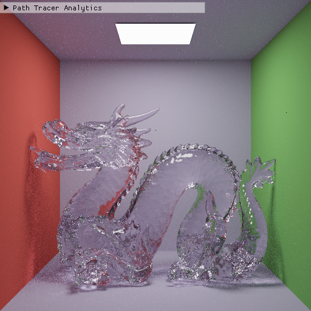
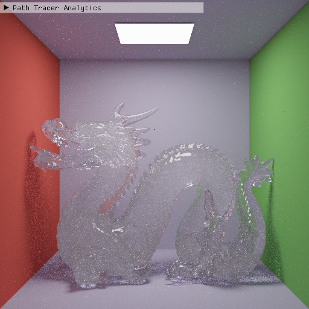
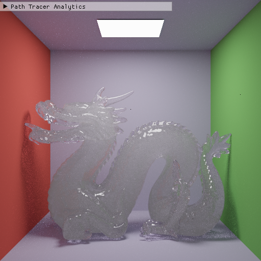
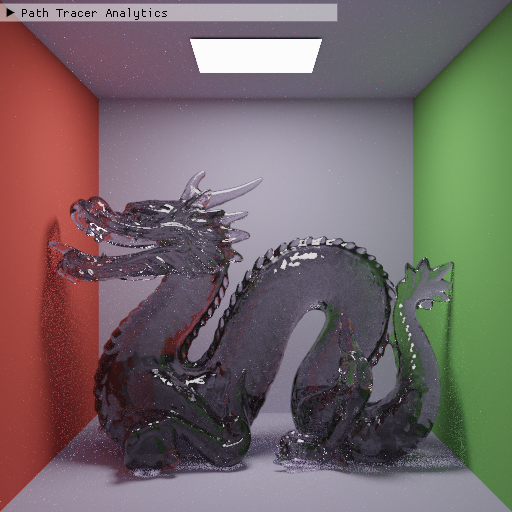
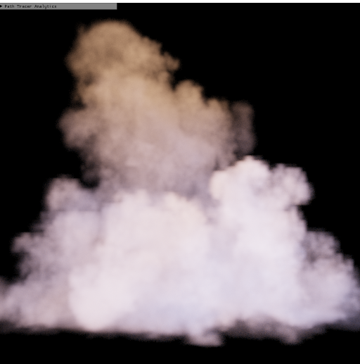
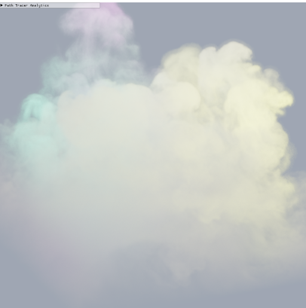

GPU-Accelerated Heterogeneous Volume Rendering with Null-Collisions
================

**University of Pennsylvania, CIS 565: GPU Programming and Architecture, Final Project**

* Nick Moon
  * [LinkedIn](https://www.linkedin.com/in/nick-moon1/), [personal website](https://nicholasmoon.github.io/)
* Megan Reddy
  * [LinkedIn](https://www.linkedin.com/in/meganr25a949125/), [personal website](https://meganr28.github.io/)
* Tested on: Windows 10, AMD Ryzen 9 5900HS with Radeon Graphics @ 3301 MHz 16GB, NVIDIA GeForce RTX 3060 Laptop GPU 6GB (Personal Computer)

### Overview

**Physically-based volume rendering** is widely used in the entertainment and scientific engineering fields for rendering phenomena such as clouds, fog, smoke, and fire. This usually involves complex lighting computations, especially for volumes that vary spatially and spectrally. Production renderers leverage multiple importance sampling (MIS) to accelerate image synthesis for rendering surfaces. MIS techniques for volumes are unbiased only for homogeneous media. Therefore, we require a new technique to perform MIS for heterogeneous media. 

The [null-scattering path integral formulation](https://cs.dartmouth.edu/wjarosz/publications/miller19null.html) (Miller et al. 2019) enables us to use MIS for any media and generalizes previous techniques such as ratio tracking, delta tracking, and spectral tracking. It analytically solves for the pdf of a light path during runtime, allowing us to combine several sampling techniques at once using MIS. Additionally, null-scattering introduces fictitious matter into the volume, which does not affect light transport, but instead allows us to "homogenize" the total density and analytically sample collisions. We implement the null-scattering formulation in **CUDA** and use **NanoVDB** for loading volumetric data. 

[Place representative images here]

### Presentations

[Final Project Pitch](https://docs.google.com/presentation/d/1bVFEcVQq_lp9oRMo1wMy-prI_6DmvS1U/edit?usp=sharing&ouid=114838708762215680291&rtpof=true&sd=true)

[Milestone 1 Presentation](https://docs.google.com/presentation/d/14UCT0gwEhKlZwesXNz6KYzMYFSW_foeX/edit?usp=sharing&ouid=114838708762215680291&rtpof=true&sd=true)

[Milestone 2 Presentation](https://docs.google.com/presentation/d/1hIc8dso9Vw6BNq6eRFusN4aV4GLUBG46/edit?usp=sharing&ouid=114838708762215680291&rtpof=true&sd=true)

[Milestone 3 Presentation](https://docs.google.com/presentation/d/15A4sxapjhbVR1eCHo42OMfnLYpHewG0q/edit?usp=sharing&ouid=114838708762215680291&rtpof=true&sd=true)

### Features Implemented

- Completed
    * Heterogeneous media
      * Null-scattering MIS (next-event estimation and phase sampling)
      * Delta tracking
    * Homogeneous media
    * Interactions between surface and media
    * Volumes on the inside and outside of objects (medium interfaces)
    * Handling spectrally-varying absorption and scattering coefficients
    * Loading .vdb files
- In-Progress 
    * Spectral MIS (with [hero wavelength sampling](https://cgg.mff.cuni.cz/publications/hero-wavelength-spectral-sampling/))
      
### GUI Controls

- Ray Depth - number of times light will bounce in each ray path
- Absorption - amount of light absorbed while interacting with the medium (higher = darker)
- Scattering - amount of light scattering inside of the medium (out-scattering and in-scattering)
- Phase Asymmetry Factor - influences the direction of light scattering within the medium

### Build Instructions

To build this project, ensure that you have a **CUDA-enabled** NVIDIA GPU. We have provided some other
basic requirements below:

1. Open the `.sln` file in Visual Studio and build in **Release** mode
2. In order to run a `.txt` file from the `scenes` folder, you must provide a command line argument. You can do this two ways:
    * Call the program with the argument: `null-collision-volumes-cuda scenes/cornell_boxes.txt` 
    * In Visual Studio, navigate to your project `Properties` and select `Configuration Properties -> Debugging -> Command Arguments` and provide the path to the scene file:
 `../scenes/cornell_boxes.txt`. Note that you may need to provide the full path instead of the relative path.
3. In `Properties -> C/C++ -> Optimization`, select `Maximum Optimization (Favor Speed) (/O2)`
4. In `Properties -> C/C++ -> Code Generation -> Runtime Library`, select `Multi-threaded (/MT)`
5. When building with `cmake`, if you run into an issue where it cannot find a library file, make sure the appropriate `.lib` file is in the `external` folder.

#### OpenVDB and NanoVDB

This project depends on OpenVDB and NanoVDB for loading volumetric data. We followed the build instructions for `Windows`, however, the [official OpenVDB development repository](https://github.com/AcademySoftwareFoundation/openvdb) has directions for other platforms.
The installation process for Windows was quite complicated and lengthy for us, so we've included the steps of our process incase it is of use to anyone else. Note that these might not necessarily be executed in order, and that building OpenVDB might
differ depending on your system setup.

1. Install [vcpkg](https://github.com/microsoft/vcpkg), [CMake](https://cmake.org/), and [Visual Studio](https://visualstudio.microsoft.com/downloads/).
2. Run these commands in the directory with `vcpkg.exe` to install OpenVDB dependencies: 

```
vcpkg install zlib:x64-windows
vcpkg install blosc:x64-windows
vcpkg install tbb:x64-windows
vcpkg install boost-iostreams:x64-windows
vcpkg install boost-any:x64-windows
vcpkg install boost-algorithm:x64-windows
vcpkg install boost-uuid:x64-windows
vcpkg install boost-interprocess:x64-windows
vcpkg install openvdb:x64-windows
```

3. Clone and build the OpenVDB repository using the instructions [here](https://github.com/AcademySoftwareFoundation/openvdb) under `Windows -> Building OpenVDB`.
4. Place the resulting `openvdb` directory within your project.
5. Create a Visual Studio solution with CMake. We found the instructions [here](https://visualstudio.microsoft.com/downloads/) quite helpful (under `Build Steps`). 
5. In `FindOpenVDB.cmake`, remove lines 655-662 (this is old functionality). This file should be located under `vcpkg/installed/x64-windows/share/openvdb`.
6. In `CMakeLists.txt`, change `cmake_minimum_required(VERSION 3.1)` to `cmake_minimum_required(VERSION 3.18)`.
7. In `CMakeLists.txt`, add the following lines at the bottom of the file to include OpenVDB as a dependency. Replace the `vcpkg` path with the path to your installation.

```
list(APPEND CMAKE_MODULE_PATH "C:/src/vcpkg/vcpkg/installed/x64-windows/share/openvdb")
find_package(OpenVDB REQUIRED)
target_link_libraries(${CMAKE_PROJECT_NAME} OpenVDB::openvdb)
```

8. Include the appropriate header files in your project and see if you can build successfully. If not, check the OpenVDB site for [Troubleshooting tips](https://www.openvdb.org/documentation/doxygen/build.html#buildTroubleshooting). 
9. Note that NanoVDB files are included in the `openvdb` directory that you cloned. 

### Work-In-Progress Output

#### Homogeneous Media

##### Environment Volume

| "Underwater" Spheres |  Fog Caustic |
:-------------------------:|:-------------------------:
  |  

##### Surface vs. Volume

| Pure Glass |  Pure Volume |
:-------------------------:|:-------------------------:
  |  

##### Varying Phase Asymmetry 

| Forward Scattering (positive g) |  Back Scattering (negative g) |
:-------------------------:|:-------------------------:
  |  

##### Varying Extinction (Absorption + Scattering) 

| Extinction Value  |      Result |
|:----------:    |:-------------:  |
| Low Extinction        |     | 
| High Extinction       |     |
| High Scattering       |     |
| High Absorption       |     |

#### Heterogeneous Media with Delta Tracking

| Scene  |      Result |
|:----------:    |:-------------:  |
| OpenVDB Smoke 1                    |     | 
| Intel Cloud (low resolution)       |     |
| Intel Cloud (medium resolution)    |     |
| OpenVDB Smoke 2                    |     |

#### Heterogeneous Media with Null-Scattering MIS

| Delta Tracking  | Null-Scattering MIS (NEE + Unidirectional) |
|:----------:    |:-------------:  |
|  |   |

### Performance

#### Delta Tracking vs. Null Scattering MIS

| Delta Tracking (26 ms/frame)  | Null-Scattering MIS (18 ms/frame)  |
|:----------:    |:-------------:  |
|  |   |

#### Ray Depth

| Depth  |      Result |
|:----------:    |:-------------:  |
| Depth 2  (14 ms/frame)      |     | 
| Depth 8  (22 ms/frame)      |     |
| Depth 32 (30 ms/frame)      |     |
| Depth 128 (60 ms/frame)     |     |
