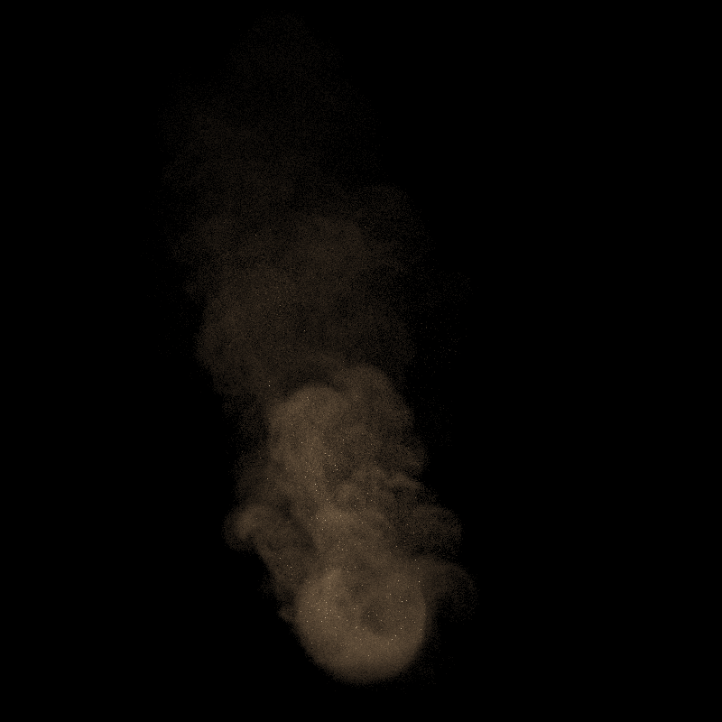
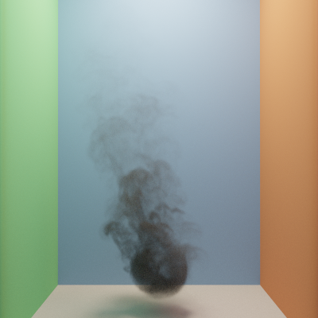
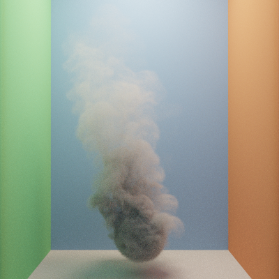
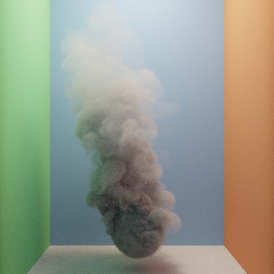

GPU-Accelerated Heterogeneous Volume Rendering with Null-Collisions
================

**University of Pennsylvania, CIS 565: GPU Programming and Architecture, Final Project**

* Nick Moon
  * [LinkedIn](https://www.linkedin.com/in/nick-moon1/), [personal website](https://nicholasmoon.github.io/)
* Megan Reddy
  * [LinkedIn](https://www.linkedin.com/in/meganr25a949125/), [personal website](https://meganr28.github.io/)
* Tested on: Windows 10, AMD Ryzen 9 5900HS with Radeon Graphics @ 3301 MHz 16GB, NVIDIA GeForce RTX 3060 Laptop GPU 6GB (Personal Computer)

### Overview


<p align="center"><em>WDAS Cloud rendered in a (procedural) sunset with null-scattering MIS framework (5000 spp)</em></p>

**Physically-based volume rendering** is widely used in the entertainment and scientific engineering fields for rendering phenomena such as clouds, fog, smoke, and fire. This usually involves complex lighting computations, especially for volumes that vary spatially and spectrally. Production renderers leverage multiple importance sampling (MIS) to accelerate image synthesis for rendering surfaces. MIS techniques for volumes are unbiased only for homogeneous media. Therefore, we require a new technique to perform MIS for heterogeneous media. 

The [null-scattering path integral formulation](https://cs.dartmouth.edu/wjarosz/publications/miller19null.html) (Miller et al. 2019) enables us to use MIS for any media and generalizes previous techniques such as ratio tracking, delta tracking, and spectral tracking. It analytically solves for the pdf of a light path during runtime, allowing us to combine several sampling techniques at once using MIS. Additionally, null-scattering introduces fictitious matter into the volume, which does not affect light transport, but instead allows us to "homogenize" the total density and analytically sample collisions. We implement the null-scattering formulation in **CUDA** and use **NanoVDB** for loading volumetric data. 


<p align="center"><em>EmberGen Smoke Plume rendered in a galactic setting (1000 spp)</em></p>


<p align="center"><em>Mesh dragon, volumetric bunny, and assorted spheres interacting in a scene. Notice how the bunny is visible in both the reflective sphere and glass sphere and casts shadows on the ground.</em></p>

### Presentations

[Final Project Pitch](https://docs.google.com/presentation/d/1bVFEcVQq_lp9oRMo1wMy-prI_6DmvS1U/edit?usp=sharing&ouid=114838708762215680291&rtpof=true&sd=true)

[Milestone 1 Presentation](https://docs.google.com/presentation/d/14UCT0gwEhKlZwesXNz6KYzMYFSW_foeX/edit?usp=sharing&ouid=114838708762215680291&rtpof=true&sd=true)

[Milestone 2 Presentation](https://docs.google.com/presentation/d/1hIc8dso9Vw6BNq6eRFusN4aV4GLUBG46/edit?usp=sharing&ouid=114838708762215680291&rtpof=true&sd=true)

[Milestone 3 Presentation](https://docs.google.com/presentation/d/15A4sxapjhbVR1eCHo42OMfnLYpHewG0q/edit?usp=sharing&ouid=114838708762215680291&rtpof=true&sd=true)

### Features Implemented

* Heterogeneous media
  * Null-scattering MIS (next-event estimation and phase sampling)
  * Delta tracking
* Homogeneous media
* Interactions between surface and media
* Volumes on the inside and outside of objects (medium interfaces)
* Loading .vdb files with NanoVDB
* Basic image-based lighting
* LBVH for mesh intersection optimization
* Interactive GUI
      
### Usage

#### Rendering Controls

- `Integrator` - choose between Null-Scattering MIS, Delta Tracking NEE, and Surface MIS integrator engines
- `Importance Sampling` - choose between Unidirectional/BSDF sampling, Next Event Estimation/Direct Light sampling, and MIS which combines the two
- `Max Ray Depth` - choose the number of times light will bounce in each ray path
- `Extra Depth Padding` - add extra bounces to the ray path to account for passing through "invisible" AABBs
- `Refresh Rate` - how many times the interactive render updates with the most current rendered image

#### Camera Controls

- `FOV` - changes the field of view of the camera
- `Focal Distance` - changes the focal distance of the camera
- `Lens Radius` - changes the lens radius of the camera

#### Volumetric Controls

- `Absorption` - amount of light absorbed while interacting with the medium (higher = darker)
- `Scattering` - amount of light scattering inside of the medium (out-scattering and in-scattering)
- `Asymmetry` - influences the direction of light scattering within the medium
- `Density Offset` - adds a constant amount of density to the vdb grid (adding a lot effectively creates a "homogeneous" medium)
- `Density Scale` - multiplies all the density values in the grid by a constant amount, making the contrast between empty space and particles more apparent

### Build Instructions

To build this project, ensure that you have a **CUDA-enabled** NVIDIA GPU. We have provided some other basic requirements in the collapsable menu below:

<details>
  <summary>Build steps</summary>

1. Open the `.sln` file in Visual Studio and build in **Release** mode
2. In order to run a `.txt` file from the `scenes` folder, you must provide a command line argument. You can do this two ways:
    * Call the program with the argument: `null-collision-volumes-cuda scenes/cornell_boxes.txt` 
    * In Visual Studio, navigate to your project `Properties` and select `Configuration Properties -> Debugging -> Command Arguments` and provide the path to the scene file:
 `../scenes/cornell_boxes.txt`. Note that you may need to provide the full path instead of the relative path.
3. In `Properties -> C/C++ -> Optimization`, select `Maximum Optimization (Favor Speed) (/O2)`
4. In `Properties -> C/C++ -> Code Generation -> Runtime Library`, select `Multi-threaded (/MT)`
5. When building with `cmake`, if you run into an issue where it cannot find a library file, make sure the appropriate `.lib` file is in the `external` folder.

</details>

#### OpenVDB and NanoVDB

This project depends on OpenVDB and NanoVDB for loading volumetric data. We followed the build instructions for `Windows`, however, the [official OpenVDB development repository](https://github.com/AcademySoftwareFoundation/openvdb) has directions for other platforms.
The installation process for Windows was quite complicated and lengthy for us, so we've included the steps of our process incase it is of use to anyone else. Note that these might not necessarily be executed in order, and that building OpenVDB might differ depending on your system setup.

<details>
  <summary>Build steps</summary>

1. Install [vcpkg](https://github.com/microsoft/vcpkg), [CMake](https://cmake.org/), and [Visual Studio](https://visualstudio.microsoft.com/downloads/).
2. Run these commands in the directory with `vcpkg.exe` to install OpenVDB dependencies: 

```
vcpkg install zlib:x64-windows
vcpkg install blosc:x64-windows
vcpkg install tbb:x64-windows
vcpkg install boost-iostreams:x64-windows
vcpkg install boost-any:x64-windows
vcpkg install boost-algorithm:x64-windows
vcpkg install boost-uuid:x64-windows
vcpkg install boost-interprocess:x64-windows
vcpkg install openvdb:x64-windows
```

3. Clone and build the OpenVDB repository using the instructions [here](https://github.com/AcademySoftwareFoundation/openvdb) under `Windows -> Building OpenVDB`.
4. Place the resulting `openvdb` directory within your project.
5. Create a Visual Studio solution with CMake. We found the instructions [here](https://visualstudio.microsoft.com/downloads/) quite helpful (under `Build Steps`). 
5. In `FindOpenVDB.cmake`, remove lines 655-662 (this is old functionality). This file should be located under `vcpkg/installed/x64-windows/share/openvdb`.
6. In `CMakeLists.txt`, change `cmake_minimum_required(VERSION 3.1)` to `cmake_minimum_required(VERSION 3.18)`.
7. In `CMakeLists.txt`, add the following lines at the bottom of the file to include OpenVDB as a dependency. Replace the `vcpkg` path with the path to your installation.

```
list(APPEND CMAKE_MODULE_PATH "C:/src/vcpkg/vcpkg/installed/x64-windows/share/openvdb")
find_package(OpenVDB REQUIRED)
target_link_libraries(${CMAKE_PROJECT_NAME} OpenVDB::openvdb)
```

8. Include the appropriate header files in your project and see if you can build successfully. If not, check the OpenVDB site for [Troubleshooting tips](https://www.openvdb.org/documentation/doxygen/build.html#buildTroubleshooting). 
9. Note that NanoVDB files are included in the `openvdb` directory that you cloned.

</details>

### Main Concepts

#### Null-Scattering

Null-collision approaches to unbiased, heterogeneous volume rendering involve augmenting a heterogeneous volume with "null particles." This is done by storing the maximum density of the volume and using it as the basis for sampling the volume. These null particles serve to "homogenize" the volume, which allows us to analytically sample the transmittance. The diagram below visualizes this process. 

There are three main medium interaction events that can occur: the **absorption**, **scattering**, and **null-scattering** events. The absorption event means that the path has terminated, as the remaining light throughput has been absorb by the medium. Scattering means that Next Event Estimation is performed at the position where the scattering event occured, and then the phase function of the medium is sampled at that location to determine a new outgoing direction `wi` for the ray. This is essentially like sampling the BSDF for a surface, which generates an `wi`, a pdf value, and `f`. Finally, null scattering means that the ray continues to traverse the medium in the same direction, where a new sample point through the medium will be generated and the next interaction event will occur. 


#### Null-Scattering MIS

The disadvantage of previous null-collision approaches is that they do not allow us to track path pdfs throughout a volume. In order to do this, Miller et al. 2019 propose a path integral formulation of null-scattering, which allows us to compute path sampling pdfs and combine multiple unbiased sampling techniques for volumes using MIS. In this project, we implement the path integral formulation of null-scattering and combine next event estimation (direct light sampling) with unidirectional sampling (phase function/BSDF).

### Pipeline 

The CUDA kernel setup for the null-collision MIS framework is shown below, next to the diagram for the `sampleParticipatingMedium` kernel in particular. Overall, the volumetric integrator
is similar to a normal surface integrator with MIS, with the key difference being: when a medium is entered by a ray, the `sampleParticipatingMedium` kernel will march through the medium until it reaches
a scattering event, or is absorb by the medium. Additionally, due to the path integral formulation nature of the implementation, all pdfs and weights for MIS are tracked and calculated throughout all segments of the
path. This allows for MIS within a participating medium, as well as with paths that encounter both surfaces and media.

The three main events that the `sampleParticipatingMedium` kernel samples each iteration are `absorb`, `scatter`, and `null scatter`, as described above.

We attempted to unroll the while loop in this function that traverses the medium into seperate kernel call iterations, but this resulted in a large number of "max depth padding" being needed
to account for the large amount of null collisions that can occur, and it was difficult to seperate out the normal path traversal from the media traversal. Future work could look into optimizing
iteration between and through these two events.

| Null Scattering MIS Kernel Layout  | Sample Participating Media Kernel Layout | 
|:----------:    |:-------------:  |
|  |  |

### Results

#### Loading Volumetric Data with NanoVDB

We use NanoVDB for loading and parsing volumetric data. NanoVDB is developed by NVIDIA and adds GPU acceleration support to OpenVDB. Since we did not use `.nvdb` files (the type supported by NanoVDB), we also
had to build OpenVDB to convert `.vdb` files to `.nvdb` for loading density grids. By itself, however, NanoVDB does not depend on OpenVDB. In the following images, we have rendered a few different `.vdb` files.

| Cloud Bunny (OpenVDB)  | Smoke (OpenVDB) | Torus (EmberGen)
|:----------:    |:-------------:  |:-------------:  |
|  |  | 

#### Unidirectional, Next-Event Estimation (NEE), and Uni + NEE MIS

To verify that our null-scattering framework was working as expected, we followed similar lighting setups to the ones described in the paper.
 
Our first setup involved a thin medium with a single large area light behind the volume. In this case, we see that the unidirectional sampling performs better because the light is larger and better aligned with the sample direction returned by the phase function, which has a high magnitude asymmetry factor `g`. Next event estimation does not perform well because the light is large and more samples will be taken in directions that do not contribute to the incoming radiance. By using MIS, we can efficiently handle this scene by combining the contributions of Unidirectional Sampling and Next Event Estimation. 

| Unidirectional  | Next-Event Estimation (NEE) | Unidirectional + NEE
|:----------:    |:-------------:  |:-------------:  |
|  |  | 

Our second setup involved a dense medium with a small area light on the left-hand side. Here, we see that unidirectional sampling does not perform well because the light is small and easy to miss by our phase function sample directions. Next event estimation, on the other hand, performs very well in this case since sampling the small light source directly ensures that each point adequately receives the incoming radiance. As expected, MIS is able to efficiently handle this case. 

| Unidirectional  | Next-Event Estimation (NEE) | Unidirectional + NEE
|:----------:    |:-------------:  |:-------------:  |
|  |  | 

#### Varying Coefficients

There are three main volume scattering processes that impact light transport within a scene: absorption, scattering, and emission. We handle the first two in our implementation. Additionally, the amount of light being transmitted through the volume is dictated by the **Beer-Lambert** Law: `T = exp(-sigma_t * distance)`. As `sigma_t` (absorption + scattering) or `distance` increases, the medium becomes denser due to lower transmittance. 

##### Absorption

Absorption refers to the decrease in radiance as light travels through the medium. In the examples below, the smoke becomes thicker and darker as you increase the 
absorption coefficient (denoted by sigma_a in volume rendering literature and our code). A higher absorption coefficient means that as light travels through the medium,
the medium's particles absorb more of it. Therefore, less light reaches the viewer and the smoke plume appears darker. Increasing the absorption coefficient also increases the density of the medium as described by Beer's Law above. 

| sigma_a = 0.1  |  sigma_a = 0.2 | sigma_a = 0.4 | sigma_a = 0.8 |
|:----------:    |:-------------:  |:-------------:  |:-------------:  |
|   |    |  | 

##### Scattering

As a ray passes through a medium, it may scatter in different directions due to interactions with particles. Scattering involves both out-scattering, where the total
radiance is reduced because of the ray being deflected out of the path, and in-scattering, where the total radiance is increased due to light being scattered into the path. In the images below, we see that the smoke is lighter than in the images where absorption was the dominant effect. Although some light is attenuated as it travels farther through the medium, some light that is not traveling towards the viewer is redirected towards the eye. Similar to the absorption images, we notice that the smoke becomes denser as the scattering coefficient increases. 

| sigma_s = 0.1  | sigma_s = 0.2 | sigma_s = 0.4 | sigma_s = 0.8 |
|:----------:    |:-------------:  |:-------------:  |:-------------:  |
|   |    |  | 

##### Density

In homogeneous media, we have uniform density. In heterogeneous media, we have varying density over space. In the null-scattering framework, we set `sigma_t` equal 
to `sigma_a + sigma_s + sigma_n`. The new null coefficient `sigma_n` is not user-specified, but rather computed from the `sigma_a` and `sigma_s` values. We know that `sigma_t` is homogeneous, therefore we can set it to `max_density * (sigma_a + sigma_s)`, where `max_density` is the maximum density value in the voxel grid. Now, we can solve for `sigma_n`. This also ensures that none of the coefficients are negative. Increasing the multiplier for `max_density` increases the runtime, but does not change the result visually. This is because it increases the number of ray marching steps, causing us to take smaller steps through the medium. 

In the images below, we augment the density in a different manner. Instead of increasing the `max_density` value, we multiply each density value in the voxel grid by a constant amount. As we increase the multiplier, the medium appears more dense. 

| 1x  | 5x | 10x | 30x |
|:----------:    |:-------------:  |:-------------:  |:-------------:  |
|   |    |  | 

#### Henyey-Greenstein Phase Asymmetry Factor

The phase function of a volume is analogous to the BSDF of a surface since it describes the distribution of light being scattered. We implemented the commonly-used Henyey-Greenstein phase function, which is controlled by an asymmetry factor `g` that is within the range (-1, 1). Negative `g` values indicate back-scattering, where light is scattered back towards the incoming ray direction. Positive `g` values indicate forward-scattering, where light is scattered in the direction it was traveling. In the images below, notice how the back-scattering allows more light to reach the camera, whereas the forward-scattering is much darker. A `g` value of 0 indicates isotropic scattering, where it has the same value in different directions. Visually, it is almost an average of the back-scattering and forward-scattering images. 

| Back Scattering (g = -0.8) |   Near Isotropic Scattering (g = 0.001) |   Forward Scattering (g = 0.8) |
|:----------:    |:-------------:  |:-------------:  |
|   |    | 

### Performance

#### Testing Parameters

The following performance results were obtained 

The camera and lighting parameters are the same between the two scenes; the only difference is the setting in which we placed
smoke plume. Unless otherwise noted, we used these additional parameters:

- `Absorption`: 0.02
- `Scattering`: 0.2061
- `Phase Asymmetry`: 0.001
- `Iteration Count`: 20
- `Ray Depth`: 1
- `Resolution`: 800 x 800

For testing, we turned GUI rendering off (this took about 20 ms of render time). We wrapped the call to our `fullVolPathtrace` function
with a call to our `PerformanceTimer` class's functions `startGpuTimer` and `endGpuTimer`. We recorded the average rendering time over 
20 iterations. 

#### Unidirectional, Next-Event Estimation (NEE), and Uni + NEE MIS

These graphs show the performance results on the two MIS testing scenes from above. Because in our integrator we use the same sampled wi for both GI and
also BSDF/Phase function sampling, the unidirectional importance sampling technique is fastest. However, as mentioned above, there are cases where one or the other
is not as good at obtaining the incoming light information, so MIS is a good strategy to have given it comes at a relatively low performance cost.


#### Varying Absorption, Scattering, and Phase Asymmetry

The graph below showcases the impact of varying the absorption coefficient for the medium. The runtime impact
of increasing this value appears to be roughly linear. This makes sense, as the rate of sample points along a ray within a medium is
dependent on the coefficients of absorption and scattering.


The graph below showcases the impact of varying the scattering coefficient for the medium. The runtime impact
of increasing this value appears to also be roughly linear, for about the same reason as increasing the absorption.
However, the slope of the linear increase is far greater, as increasing the scattering will increase the amount of rays
that bounce through multiple-scattering and global-illumination paths, thus causing signifcant performance drawbacks.
Doubling the scattering coefficient, while making the medium look more cloud-like, will result in a 2x performance hit.


The graph below showcases the impact of varying the phase function asymmetry of the medium. Because the phase function
does not factor into the rate of sample points along a ray travelling through a medium, varying the asymmetry does not
really have an impact on performance in terms of runtime. As was shown above, it does have an impact on convergence, however,
depending on the importance sampling strategy chosen.


#### Single Scattering vs. Multiple Scattering

The graph below showcases the impact of increasing the maximum allowed bounces that can 
occur within a medium when a scattering event takes place. This increases the runtime in a similar way
that increasing the maximum ray depth in a surface path tracer will, except in this
cases all of the additional depth is spent inside the same volume.


#### Varying Media Density Scale

The graph below showcases the performance impact of increasing the scale of the density data within the vdb structure.
While increasing the scale increases the amount of the volume that interacts with light and creates much more detail in the
volumetric data, it also increases the performance time as well. And, naturally, scaling up all the density values also increases
the max density, and so this is where the performance hit is obtained.


#### Varying Max Density Scale

The graph below showcases the impact of artificially augmenting the max density by some constant amount.
This means that this test doesn't change the actual density data in the vdb grid, but instead
scales the calculated max density of the grid up. Doing this will still yield a physically correct
result, however will dramatically increase the runtime. This is because the max density
is used to calculate the majorant for the vdb volumetric grid, and this majorant is what determines
the rate of interaction sampling within the medium. Increasing this max density value will
thus increase the amount of marching through the volume the integrator is performing, because
we step smaller distances. 


#### Varying Scene Type (Box vs. Void)

The graph below showcases the impact of having participating media and surfaces interact within
a scene. While the lighting benefits of the global illumination showcase a much more realistic
looking smoke cloud, the performance impact is much worse. This is because, in the scene
with nothing but a single area light, most of the rays either end when cast directly from the camera,
or end as soon as they escape the bouding box of the participating medium. However, in the
scene with the smoke surrounded on all sides by surfaces, all rays that bounce on the walls will
potentially enter the medium at subsequent bounces, and rays that leave the medium will then
go on to interact with the walls. This means that adding an additional maximum ray depth means
more multiple scattering in indirect lighting passes, which is realistic, but definitely a performance
hit. Future work could entail seperating the amount of multiple scattering within volumes from
the global illumination of the surfaces in the scene.


#### Other Optimizations

We tried a few optimization strategies to speed up our volume renderer. One idea was to use stream compaction 
to remove terminated rays after each bounce. Another strategy was to sort the rays by their medium type, where rays
heading into a medium and those not heading into a medium will be grouped together. The intention was to ensure that 
similar rays would follow similar branches in the code, thus creating coherency and speeding up the code. Unfortunately,
neither of these strategies seemed to help and instead decreased performance. 

Some minor optimizations we made were reducing the number of global memory reads and the number of parameters being passed
into each kernel. Once we removed some of our unused parameters and consolidated some of the others, we gained a small performance boost. 
Our `sampleParticipatingMedium` and `handleSurfaceInteraction` kernels are faster by 2 ms with these changes.

### Future Work Directions

There are many interesting ways to extend this project and several features that we would like to implement in a future iteration of this work:

- Spectral rendering
- Spectral MIS
- Subsurface scattering
- Bidirectional path tracing
- Further optimization

### References

- [A null-scattering path integral formulation of light transport](https://cs.dartmouth.edu/wjarosz/publications/miller19null.html) - Miller et al. 2019
- [Dartmouth CS 87 Rendering Algorithms Course Notes](https://cs87-dartmouth.github.io/Fall2022/schedule.html) - Wojciech Jarosz
- [Path Tracing in Production - Volumes](https://jo.dreggn.org/path-tracing-in-production/2019/christopher_kulla.pdf) - Christopher Kulla
- [Volume Rendering for Developers](https://www.scratchapixel.com/lessons/3d-basic-rendering/volume-rendering-for-developers) - Scratchapixel
- [PBRT v3 Chapter 15 - Volumetric Light Transport](https://www.pbr-book.org/3ed-2018/Light_Transport_II_Volume_Rendering)
- [PBRT v4](https://github.com/mmp/pbrt-v4)

#### Volumetric Data and Environment Maps

- [Open/NanoVDB Repository](https://www.openvdb.org/) - Smoke Plumes, Cloud Bunny
- [Intel Volumetric Clouds Library](https://dpel.aswf.io/intel-cloud-library/) - Intel Cloud
- [Disney Cloud Dataset](https://disneyanimation.com/resources/clouds/) - Disney Cloud
- [JangaFX Free VDB Animations](https://jangafx.com/software/embergen/download/free-vdb-animations/)
- [sIBL Archive](http://www.hdrlabs.com/sibl/archive.html) - HDR Environment Maps

#### Acknowledgements

We would like to thank the following individuals for their help and support throughout this project:

- **Yining Karl Li** for discussing initial project ideas with us and pointing us to helpful resources about state-of-the-art physically-based rendering techniques and null-scattering volumes
- **Bailey Miller** for answering initial questions we had about the project, providing implementation tips, and pointing us to notable reference implementations
- **Wojciech Jarosz** for providing answers to conceptual questions we had during implementation
- **Adam Mally** for providing us with a strong foundation in physically-based rendering in UPenn CIS 561
